# Foldning
Mads Peter Steenstrup, 10. marts 2024

## Grundlæggende Koncept

Foldning er en matematisk metode til at kombinere to signaler for at danne et tredje signal. Det er en matematisk operation, der kombinerer to funktioner eller signaler for at producere et tredje. På engelsk hedder det convolution. Foldning har mange anvendelsesmuligheder inden for statistik, signalbehandling og billedbehandling. 

**Intuition:**
Foldning viser hvor meget overlap to funktioner har når man kører den ene over den anden. I figur 1 bliver det lilla rektangel kørt forbi den store røde. Overlappet vises som den grønne graf. Hvis hele det lille er inde i det røde er der maksimalt overlap, mens det er nul hvis de slet ikke overlapper. På den grønne kurve kan man se at den overlappere mere og mere ind til maksimum. Det vises bedst som en gif, se her [Wolfram Mathworld](https://mathworld.wolfram.com/images/gifs/convrect.gif). 

 \label{mylabel}](billeder/convolution1.png)

Hvis $f$ og $g$ er to funktioner, skrives deres foldning som $f * g$.

### Definition - Kontinuert foldning
Givet to kontinuerte funktioner $f(t)$ og $g(t)$ betegnes foldningen typisk med asterisk-symbolet $*$, altså $f(t)*g(t)$. Dette udregnes med integralet af produktet af de to funktioner,
$$
(f * g)(t) = \int_{-\infty}^{\infty} f(x) g(t - x) dx.
$$

Lad os kigge på funktionen $g(t-x)$ hvor $x$ er den uafhængige variabel mens $t$ giver forskydningen langs x-aksen. Hvis vi sætter $t=0$ ses det at funktionen bliver $g(-x)$. Dette svarer til at funktionen $g$ er spejlet i y-aksen.

### Øvelse
* Undersøg om funktionen gauss-funktionen $g(x) = e^{-(t-x)^2}$ forskydes til højre eller venstre når $t$ bliver større ved brug af et computerprogram.
* Prøv med en anden selvvalgt funktion.
* Overvej hvorfor funktionen netop bliver forskudt den vej.

### Matematiske egenskaber ved foldning.
Der gælder samme regler for foldning som for addition, multiplikation og division. Foldning er,

* Distributiv.
* Associativ.
* Kommutativ.

### Distributiv egenskab
Den distributive egenskab ved multiplikation siger at $x \cdot (a+b) = x \cdot a + x \cdot b$. For en foldning vil det sige at $(f*(g+h))(t) = (f*g + f*h)(t)$.

### Associative egenskab
Den associative egenskab giver, at hvad man ganger førs ved multiplikation er ligegyldig da,$a\cdot(b\cdot c) = (a\cdot b)\cdot c$. Ved foldning giver det at $(f*(g*h))(t) = ((f*g)*h)(t)$

### Kummutative egenskab
Den kommutative egenskab gør at rækkefølgen ved multiplikation er ligegyldig da, $a\cdot b = b\cdot a$. For en foldning gælder at $(f*g)(t) = (g*f)(t)$ hvilket skrevet med integralter giver $\int_{-\infty}^{\infty} f(x) g(t - x) dx = \int_{-\infty}^{\infty} f(t-x) g(x) dx$.

### Øvelse
* Vis at foldning er distributiv og associativ ved brug at integralregnereglerne.
* Vis at foldning er kommutativ ved at lave substitution, $x=t-\tilde{x}$. Overvej om det ændre integrationsgrænserne.

### Andre definitioner
Foldningens mange anvendelsesmuligheder gør, at der er mange forskellige definitioner af en foldning. Vi skal vise at de forskellige definitioner kan udledes ud fra vores definition, med valg af funktionen $g(x)$.

Ved signalbehandling bruger man ofte definitionen 
$$ (f*g)(t) = \int_0^\infty f(x)g(t-x) dx $$
hvor $t=0$ er der hvor signalet starter.

### Øvelse
Vis, ved at opdele integralet, at funktionen 
$$ g(t-x)=   \left\{
\begin{array}{ll}
      0 & x<0 \\
      h(x) & x\geq 0
\end{array} 
\right.  $$
medfører at
$$
 \int_0^\infty f(x)h(x) dx = \int_{-\infty}^\infty f(x)g(t-x) dx
$$

Vi kan altså ved at indføre stykvise funktioner ændre integrationsgrænser. Dette kan være nyttigt hvis integralet for eksempel ikke konvergerer.

## Gennemsnit
Gennemsnit over et interval $a$ kan laves med følgende funktion, 
$$
g(t-x)=   \left\{
\begin{array}{ll}
      \frac{1}{a} & 0<t\leq a \\
      0 & ellers.
\end{array} 
\right. 
$$
Lad os udnytte at vi kan ændre integrationsgrænser til at omskrive udtrykket
$$
(f*g)(t) = \int_{-\infty}^{\infty} f(x)g(x-t)dx  = \frac{1}{a}\int_0^a f(x)dx.
$$
## Øvelse
* Beregn gennemsnittet at funktionen $f(x) = \sin(x)$ over de tre intervaller $[0;\pi],[\pi,2\pi],[0,2\pi]$.
* Indtegn funktionen og de tre gennemsnit i samme koordinatsystem og tjek beregningerne.
Som det ses behøver integralet ikke starte i $0$, men kan som her starte i $\pi$. Gennemsnittet over intervallet $a$ til $b$ kan skrives som 
$$
\overline{f(x)} = \frac{1}{b-a}\int_a^b f(x) dx 
$$

### Glidene gennemsnit
Glidende gennemsnit er gennemsnit over intervallet $M = b-a$ som forskydes langs x-aksen. Det bruges ofte i databehandling for at fjerne støj. Ved at tage gennemsnittet bliver den hurtigt fluktuerende støj fjernet. Det kan også være brugbart ved tidsserier hvor man eks. vil fjerne sæsonvariation. Det ses i figur 2 hvor mængden af CO2 i atmosfæren svinger med årstiden på grund af løvfald på den nordlige halvkugle. Ved et glidende gennemsnit over et år, laves den sorte kurve som viser den voksende mængde i atmosfæren.

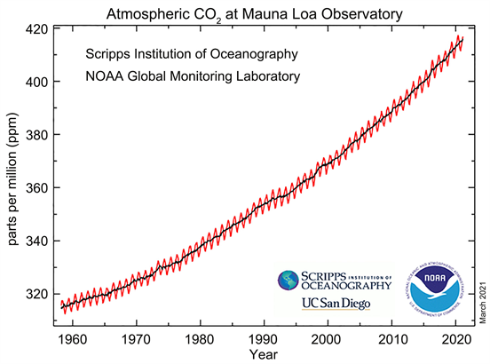

 FoldFunktionen som giver det glidende gennemsnit kan desineres som 
$$
g(t-x) = \left\{
\begin{array}{ll}
      \frac{1}{M} &, \frac{1}{2}M<x\leq \frac{1}{2}M \\
        0 &, ellers.
\end{array} 
\right. 
$$
Foldningen bliver
$$
(f*g)(t) = \int_{-\infty}^{\infty} f(x)g(x-t)dx  = \frac{1}{M}\int_{t-\frac{1}{2}M}^{t+\frac{1}{2}M} f(x)dx.
$$

### Eksempel
Funktionen $f(x) = \cos(\frac{2\pi}{10}x) + \frac{1}{3}\cos(2\pi x)$ indeholder to cosinusfunktioner med en periode på $T=10$ og  $T=1$ og en amplitude på $A=1$ og $A=\frac{1}{3}$. Den langsomme bevægelse kan findes ved et glidende gennemsnit, hvilket ses i figur 2 som den blå graf.

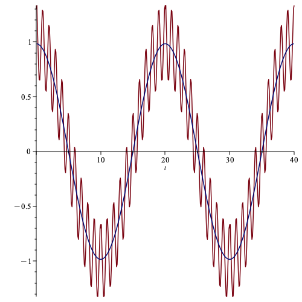

Den blå graf kommer af et glidende gennemsnit med $M=2$. Integralet kan løses til,
$$
h(t) = (f*g)(t)   = \frac{1}{2}\int_{t-1}^{t+1} \cos(\frac{2\pi}{10}x) + \frac{1}{3}\cos(2\pi x) dx = \frac{10 \cos \left(\frac{\pi  t}{10}\right) \sin \! \left(\frac{\pi}{10}\right)}{\pi}.
$$

### Øvelse
* Undersøg hvordan foldningen ændrer sig når man ændrer konstanten $M$ ved at tegne grafen ved forskellige værdier eks med $M = [0.01,0.1,1.0,4.0,8.0,16.0]$.
* Hvorfor bliver amplituden på den langsomme svingning mindre når $M$ bliver større?
* Hvor lille kan $M$ være før den hurtige svingning forsvinder?

Elektronisk kan man fjerne højfrekvent støj med et såkaldt Low Pass filter, hvor de lave frekvenser kommer igenne.

Hvis man vil have de hurtige svingninger, mens man fjerner den langsomme kan det gøres ved $f(t)-h(t)$ hvor man netop trækker den landsomme svingning fra.

Hvis man har en højdemåler med ud og vandre bruger den trykforskellen når man bevæger sig op til at beregne højdeforskellen. Trykket skifter også i forhold til vejret med høj og lavtryk. Hvis denne ændring er langsom i forhold til hvor hurtigt man bevæger sig op vil det kunne udlignes ved at beregne $f(t)-h(t)$. Hvis det gøres elektronisk kaldes det et High Pass Filter (HPF), fordi den højfrekvente information bliver bevaret.

### Øvelse
* Plot $f(t)-h(t)$ og se om det passer med et HPF.

# Billedbehandling og gauss-funktionen.
Gauss-funktionen har mange anvendeliser, også til billedbehandling. Vi vil i dette se på to anvendelser, til at sløre et billeg og til at forstærke kontrasterne. 

Den generelle gauss-funktion er,
$$
f(x) = \frac{1}{\sqrt{2\pi}\sigma} e^{-\frac{1}{2}(\frac{x-\mu}{\sigma})^2}
$$
,
hvor spredningen $\sigma$ giver bredden.

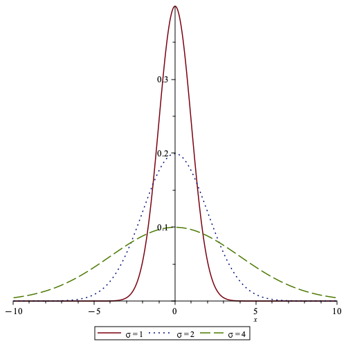

Figur 3 viser tre gauss-funktioner centreret om $\mu=0$ med forekellig spredning. Alle tre funktioner har samme areal under kurven, $1$. Ved sløring virker gauss-funktionerne som det glidende gennemsnit, men her er der mest vægt på den midsterste observation og mindre på de omkringliggende. Ved at gøre spredningen større bliver der taget et gennemsnit af flere pixels og billedet bliver mere sløret. 

Figur 4 viser et sort-hvidt billed og en repræsentation som en sinus funktion, hvor høj værdi giver hvis mens lav giver sort. Det er ikke helt korrekt at bruge en kontinuert funktion til at beskrive det sort-hvide billed, men det gør det matematisk lettere at arbejde med.

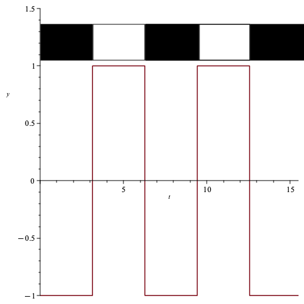

### Blure filter
Vi laver en foldning mellem firkant-funktionen og gauss-funktionen,
$$
f (x) = 
\left\{\begin{array}{cc}
-1 & x <\pi  
\\
 1 & \pi \leq x <2 \pi  
\\
...
\end{array}\right.
$$,
$$
(f*g)(t) = \frac{1}{\sqrt{2\pi}\sigma}\int_{-\infty}^{\infty}f(x)e^{-\frac{1}{2}(\frac{t-x}{\sigma})^2} dx.
$$
Dette integral løses med computer og giver den røde graf i figur 4.

Gængse billedbehandlingsprogrammer eks. open source programmet Gimp kan foretage et gaussisk-blur. I figur 5 er grafen lavet med $\sigma=1$ og blur-filtret er sat til 10 pixels standardafvigelse. Det kan ikke direkte sammenlignes med standardafvigelsen og pixelantal da vi regner i andre enheder.

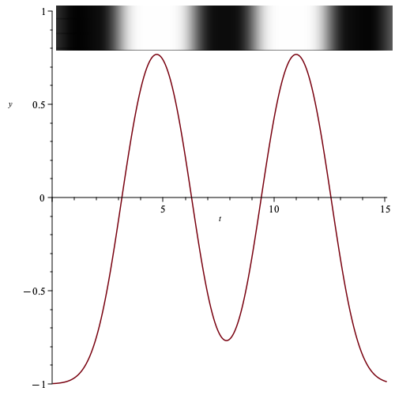

Som det ses bliver firkant-funktionen blødere af den gaussiske foldning, hvilket netop giver de udviskede kanter på billedet.

### Øvelse
* Lav en simpel firkant-funktion og prøv at lav en foldning med en gaussisk funktion.
* Undersøg hvordan man kan gøre den oprindelige funktion mere blød ved at ændre på standardafvigelsen.
* Prøv med et 2. grads polynomium i stedet for gauss-funktionen. 
Der er en online udgave af GIMP, [https://fixthephoto.com/online-gimp-editor.html](https://fixthephoto.com/online-gimp-editor.html)
* Afprøv gaussian blur filtret på et selvvalgt billed.

Ved billedbehandling er det mere relevant at bruge funktioner af to variable, så man kan have pixels angevet som $(x,y)$. Den tilhørende foldning bliver
$$
(f*g)(t,s) = \frac{1}{2\pi \sigma_x \sigma_y}\int_{-\infty}^{\infty}\int_{-\infty}^{\infty}f(x,y)e^{-\frac{1}{2}(\frac{t-x}{\sigma_x})^2}e^{-\frac{1}{2}(\frac{s-y}{\sigma_y})^2} dxdy.
$$
I praksis bruges den diskrete foldning som vil blive introduceret i næste afsnit, så vi vil ikke gøre mere ud af den kontinuerte her.

### Fourier transformationen

# Diskret foldning
Når man foretager målinger er data altid enkelte målepunkter. Hvis vi har en matematisk model kan vi, ved at bruge regression bestemme en kontinuert funktion som beskrive målepunkterne. I matematik arbejder vi ofte med disse kontinuerte funktioner og bestemmer egenskaber for dem. Der er mange situationer hvor det enten ikke er muligt eller nødvendigt at lave en sådan model.

Vi skal i dette afsnit arbejde den diskrete foldning, hvor meget at matematikken svarer til det vi har gennemgået for kontinuerte funktioner ovenfor.

### Definiton - diskret foldning
Den diskrete foldning af funktionerne $f(n)$ og $g(n)$ er givet ved
$$
(f*g)[n] = \sum_{m=-\infty}^{\infty} f[m]g[n-m],
$$
hvor $n$ og $m$ tilhører heltallene.

Som ved integralet er det vigtigt at summen konvergere, hvorved vi har en konvervent række.

Hvis $g[n]$ kun er forskellig fra nul for bestemte værdier $\{-M,-M+1,..,M-1,M\}$ kan foldningen skrives som
$$
(f*g)[n] = \sum_{m=-M}^{M} f[m]g[n-m].
$$
Et simpelt gennemsnit kan skrives som 
$$
\overline{f} = \frac{1}{M}\sum_0^{M} f = \frac{1}{M}(x_1+x_2+..+x_M), 
$$
hvilket er foldningen mellem $f=[x_1,x_2,..,x_M]$ og $g=[1,1,..,1]$. Foldningen bliver
$$
(f*g) = \frac{1}{M}\sum_0^{M} f\cdot g = \frac{1}{M}(x_1+x_2+..+x_M). 
$$
Figur 6 viser sinusfunktionen og et eksempel på 11 målinger, de røde.

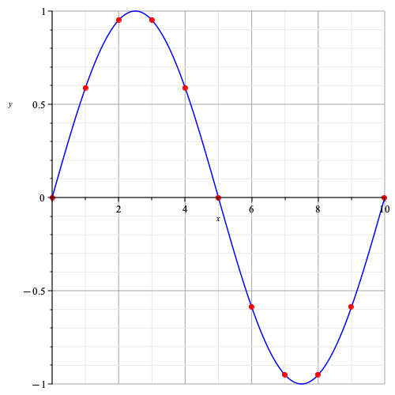

Vi kan nu opskrive de to datasæt, $f=[0., 0.588, 0.951, 0.951, 0.588, 0., -0.588, -0.951, -0.951, -0.588, 0.]$ og $g=[1,1,1,1,1,1,1,1,1,1,1]$.

### Øvelse
* Opskriv den diskrete foldning og udregn gennemsnittet.

### Glidende gennemsnit
Ved et glidende gennemsnit tages gennemsnittet at $M$ punkter rundt om punktet $n$. For at det skal være symmetrisk omkring $n$ skal $M$ være et ulige heltal. Det giver
$$
\overline{f}[n] = \frac{1}{M}\sum_{m=n-\frac{1}{2}(M-1)}^{m=n+\frac{1}{2}(M-1)} f[m].
$$

### Øvelse
* Overvej hvorfor $M$ skal være ulige.
* Argumenter for at det skal være $M-1$ ved at kigge på eksemplet hvor $M=3$.

Ved denne version af et glidende gennemsnit reduceres antallet af datapunkter med $M$.

Nedenfor ses sammen sinuskurve med et glidende gennemsnit hvor $M=3$

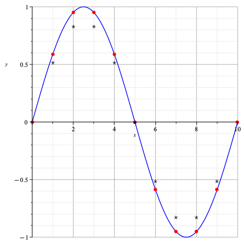

## Øvelse
Her er 101 datapunkter.
Y = 
[0.58, 0.49, 0.45, 0.58, 0.38, 0.92, 0.45, 0.99, 0.68, 0.90, 1.00, 0.64, 1.00, 0.96, 1.00, 0.93, 0.96, 0.95, 0.99, 1.00, 0.99, 0.99, 0.70, 0.98, 0.93, 0.93, 0.55, 0.84, 0.56, 0.92, 0.48, 0.92, 0.13, 0.23, 0.33, 0.79, 0.65, -0.08, 0.26, 0.57, -0.17, 0.04, 0.11, -0.17, -0.19, 0.03, -0.51, 0.17, -0.54, -0.72, -0.29, -0.77, -0.26, -0.19, -0.89, -0.31, -0.96, -0.55, -0.96, -0.58, -0.81, -0.80, -0.92, -0.81, -0.95, -1.00, -0.99, -0.99, -0.98, -1.00, -1.00, -0.98, -0.99, -0.99, -0.77, -0.83, -0.93, -0.77, -0.48, -0.71, -0.93, -0.40, -0.46, -0.38, -0.25, -0.68, -0.02, -0.18, -0.10, -0.23, 0.07, -0.29, -0.13, 0.18, -0.24, 0.57, 0.25, 0.42, 0.64, 0.68, 0.62]

X = 
[0, 1, 2, 3, 4, 5, 6, 7, 8, 9, 10, 11, 12, 13, 14, 15, 16, 17, 18, 19, 20, 21, 22, 23, 24, 25, 26, 27, 28, 29, 30, 31, 32, 33, 34, 35, 36, 37, 38, 39, 40, 41, 42, 43, 44, 45, 46, 47, 48, 49, 50, 51, 52, 53, 54, 55, 56, 57, 58, 59, 60, 61, 62, 63, 64, 65, 66, 67, 68, 69, 70, 71, 72, 73, 74, 75, 76, 77, 78, 79, 80, 81, 82, 83, 84, 85, 86, 87, 88, 89, 90, 91, 92, 93, 94, 95, 96, 97, 98, 99, 100]

* Lav et punktplot af datasættet.
De fleste matematikprogrammer kan lave glidende gennemsnit, moving average på engelsk. I maple skal man brug *with(Statistics)* og *MovingAverage(Y, M)* for at beregne det glidende gennemsnit.
* Lav et glidende gennemsnit over data hvor I ændrer $M$ så I får fjernet støjen.
* Lav et punktplot at det glidende gennemsnit.
* Lav en liste med $g=[1,1,1,1,1]\cdot 1/5$ og lav foldningen med $Y$, det skulle gerne give det samme som det glidende gennemsnit.

## Diskret foldning og billedbehandling
Billedet, vi lavede en gauss-foldning på, figur 4 kan også skrives som diskrete værdier hvor $g = [-1,1,-1,1,-1,...]$, hvor $-1$ svarer til sort og $1$ hvid og $g$ er $N$ lang.

Hvis vi gerne vil gøre billedet mere sløret kan vi eks. lave en foldning med $f=[0.1,0.8,0.1]$, hvor vi lader hver pixel være et vægtet gennemsnit af sig selv og naboernes værdier.

Foldningen bliver
$$
(f*g)[n] = \sum_{m=1}^{m=3}f[m]g[n-m]
$$
skrevet ud bliver det. 
$$
(f*g)[2] = 0.1\cdot (-1)+0.8\cdot 1+0.1\cdot (-1) = 0.6 
$$

$$
(f*g)[3] = 0.1\cdot 1+0.8\cdot (-1)+0.1\cdot 1 = -0.6 
$$

$$
(f*g)[4] = 0.1\cdot (-1)+0.8\cdot 1+0.1\cdot (-1) = 0.6 
$$

Vores output at foldningen bliver listen, $G=[0.6,-0.6,0.6,-0.6,...]$. I forhold til $g=[-1,1,-1,1,...]$ er kontrasten mindre.

### Øvelse
* Vælg en anden vægtfordeling og lav en foldning med firkant-funktionen.
* Overvej hvad der sker hvis summen af vægtene ikke er 1.

### Gauss foldning
Som vist ovenfor er gauss-fordelingen brugbar når billeder skal sløres. 

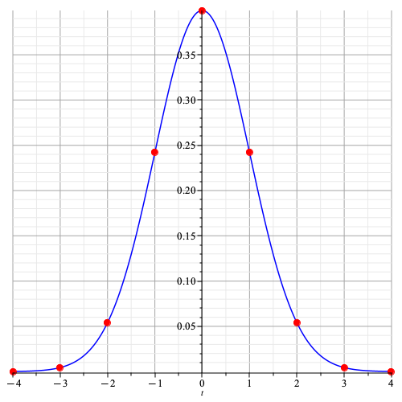

Figuren viser den kontinuerte gauss-fordeling med middelværdi $\mu=0$ og spredning $\sigma=1$. De røde punkter giver værdierne til en diskret foldning, $f=[0.000, 0.004, 0.054, 0.242, 0.399, 0.242, 0.054, 0.004, 0.000]$. Med tre decimaler afrundes fire gange spredning til nul og pixelværdierne vil være et vægtet gennemsnit af de 7 omkringliggende pixels.

### 2D

### Øvelse
Billeder kan beskrives med $x$ og $y$ koordinater og her definerer man en $N x M$ foldningsmatrice. Hvis foldningsmatricen igen er begrænset bliver det,
$$
(f*g)[x,y] = \sum_{i=-[N/2]}^{[N/2]}\sum_{i=-[M/2]}^{[M/2]}f(x-i,y-j)\cdot g(i,j)
$$
Figuren viser en animation af processen, kan findes her, [wikipedia convolution](https://upload.wikimedia.org/wikipedia/commons/1/19/2D_Convolution_Animation.gif). Her er vægtmatrricen
$$
w = \left[\begin{array}{ccc}
0 & -1 & 0 
\\
 -1 & 5 & -1 
\\
 0 & -1 & 0 
\end{array}\right]
$$

 
 

Vist som billede med høj værdi lys og lav mørk bliver det til figur xx. Billedet er blevet skarpere i den forstand at mørke regioner er blevet mørkere mens lyse er blevet lysere.

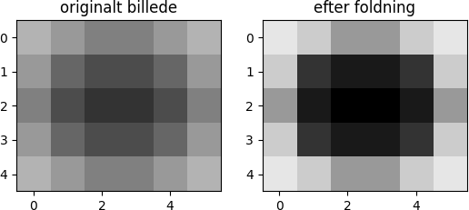

På animationen kan man se at de yderste pixel-værdier bliver beregnet ved at kopiere kendte værdier ind der hvor der mangler i foldningen. Der er mange metoder til at behandle siderne og hjørnerne, men for normale billeder hvor der er mange pixels er det simpleste at smide de yderste væk.

I figur xx ses et skakternet mønster som er foldet med samme vægt-matrice. Her er det tydeligt at foldningen før billedet skarpere. Vægtmatricen er den samme og billedet er lavet ud fra matriccen,

$$
f = \left[\begin{array}{ccccccc}
1 & 2 & 1 & 2 & 1 & 2 & 1 
\\
 2 & 1 & 2 & 1 & 2 & 1 & 2 
\\
 1 & 2 & 1 & 2 & 1 & 2 & 1 
\\
 2 & 1 & 2 & 1 & 2 & 1 & 2 
\\
 1 & 2 & 1 & 2 & 1 & 2 & 1 
\\
 2 & 1 & 2 & 1 & 2 & 1 & 2 
\\
 1 & 2 & 1 & 2 & 1 & 2 & 1 
\end{array}\right]
$$

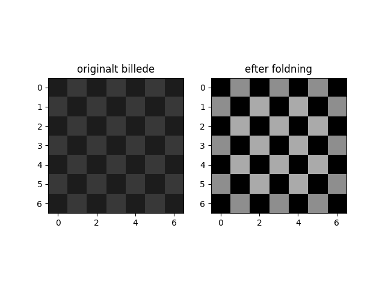

### Øvelser
* Udfør beregningen af pixelværdierne de fire midterste pixels.
* Overvej hvad der vil ske hvis vægtmatricen ikke summere til 1.

Her er et eksempel med lidt flere pixels

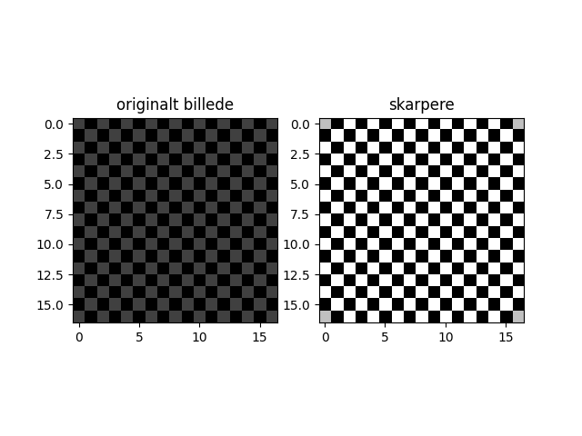

